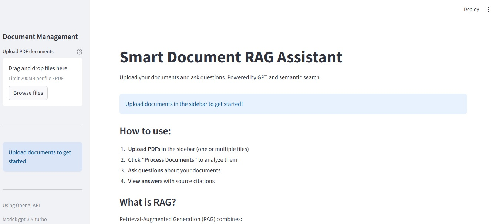
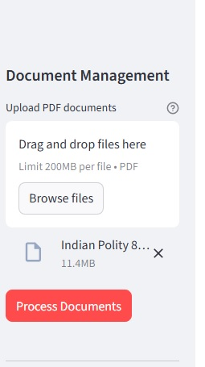
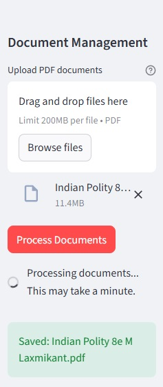
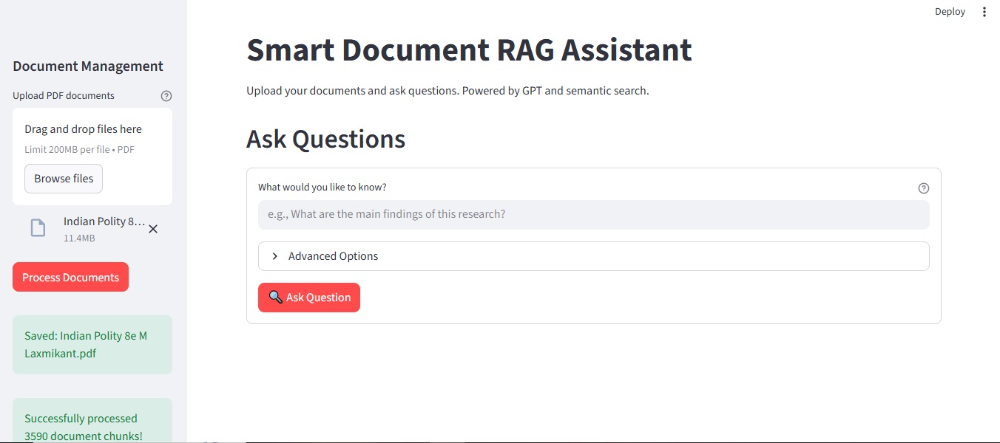
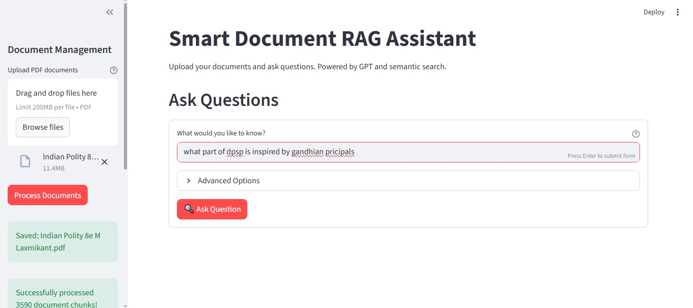
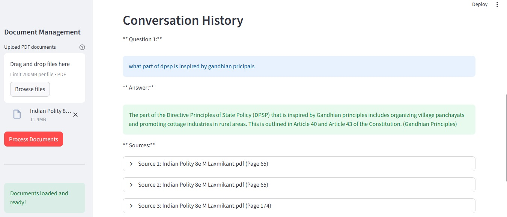

#  Smart Document RAG Assistant

An intelligent document Q&A system built with Retrieval-Augmented Generation (RAG), LangChain, and OpenAI GPT. Upload PDFs and get accurate answers with source citations.


## Features

    -Multi-document PDF upload and querying
    -Semantic search using vector embeddings
    -Source citations with page-level references
    -Conversation history within the session
    -Adjustable retrieval settings (top-k chunks)
    -Local vector database for persistence
    -Clean and beginner-friendly Streamlit interface

## Screenshots

### Welcome Screen

*Clean interface ready for document upload*

### Document Upload

*Simple file selection in sidebar*

### Document Processing

*Real-time feedback during document processing with progress indicators*

### Ready State

*Documents loaded and Q&A interface activated*

### Question Input

*Intuitive question input with advanced options*

### Answer with Source Citations

*Intelligent answers with source attribution and page numbers - the core RAG functionality in action*

### Conversation History

*Complete conversation tracking with expandable sources for transparency*


## Architecture

User Upload (PDF)
        |
        v
-----------------------------------------
Document Processing Pipeline
1. PDF → Text Extraction
2. Text → 1000-character Chunks
3. Chunks → Embeddings (1536 dimensions)
4. Store in ChromaDB
-----------------------------------------
        |
        v
-----------------------------------------
RAG Query Pipeline
1. Query → Embedding
2. Semantic Search (top-k)
3. Retrieve Relevant Chunks
4. Build Context Prompt
5. Model Generates Answer
6. Return Answer + Sources
-----------------------------------------
        |
        v
Streamlit Web Interface


## Tech Stack

| Component      | Technology        | Purpose                       |
| -------------- | ----------------- | ----------------------------- |
| Framework      | LangChain         | Orchestrates the RAG pipeline |
| LLM            | OpenAI GPT models | Generates responses           |
| Embeddings     | OpenAI Ada-002    | Creates text vectors          |
| Vector Store   | ChromaDB          | Performs semantic search      |
| UI             | Streamlit         | Web interface                 |
| PDF Processing | PyPDF             | Extracts text from PDFs       |


## Getting Started

### Prerequisites

- Python 3.9 or higher
- OpenAI API key ([Get one here](https://platform.openai.com/api-keys))
- Git

### Installation

1. **Clone the repository**
```bash
git clone https://github.com/pratulparmar/smart_doc_rag_assistant.git
cd smart_doc_rag_assistant
```

2. **Create virtual environment**
```bash
python -m venv venv

# Activate it:
# Windows (Git Bash):
source venv/Scripts/activate

# Mac/Linux:
source venv/bin/activate
```

3. **Install dependencies**
```bash
pip install -r requirements.txt
```

4. **Configure environment variables**
```bash
# Copy the example file
cp .env.example .env

# Edit .env and add your OpenAI API key
# Use any text editor (notepad, vim, nano, VSCode)
```

**Your `.env` should look like:**
```
OPENAI_API_KEY=sk-your-actual-api-key-here
OPENAI_MODEL=gpt-3.5-turbo
EMBEDDING_MODEL=text-embedding-ada-002
```

5. **Run the application**
```bash
streamlit run app.py
```

The app will open in your browser at `http://localhost:8501`

## Usage

### Basic Workflow

1. **Upload Documents**
   - Click "Browse files" in the sidebar
   - Select one or more PDF files
   - Click " Process Documents"
   - Wait ~30-60 seconds for processing

2. **Ask Questions**
   - Type your question in the text input
   - Click "Ask Question"
   - View answer with source citations

3. **Review History**
   - Scroll down to see previous Q&As
   - Expand sources to read excerpts
   - All questions are numbered and timestamped

### Example Questions
```
- What is this document about?
- Summarize the main findings in bullet points
- What methodology was used in this research?
- Compare the approaches mentioned in sections 2 and 3
- What are the key conclusions?
- Are there any limitations mentioned?
```

### Advanced Options

Click "Advanced Options" to adjust:
- **Number of chunks** (k): Controls context size
  - Lower (1-3): Faster, more focused answers
  - Higher (5-10): Slower, more comprehensive answers

## Cost Estimation

| Operation            | Cost per 1000 tokens           | Notes              |
| -------------------- | ------------------------------ | ------------------ |
| Embeddings (Ada-002) | $0.0001                        | ~100 pages ≈ $0.01 |
| GPT-3.5 Query        | $0.0005 input / $0.0015 output | ~ $0.002 typical   |
| GPT-4 Query          | $0.03 input / $0.06 output     | ~ $0.15 typical    |

Embeddings are cached locally, reducing repeated costs.

## Project Structure
```
smart_doc_rag_assistant/
├── app.py                 # Streamlit UI (main entry point)
├── rag_engine.py          # Core RAG logic & processing
├── test_rag.py           # Test suite for RAG engine
├── requirements.txt       # Python dependencies
├── .env                   # API keys (DO NOT COMMIT!)
├── .env.example          # Environment template (safe to commit)
├── .gitignore            # Git ignore rules
├── README.md             # This file
├── chroma_db/            # Vector database (auto-generated)
└── uploaded_docs/        # Temp file storage (auto-generated)
```

## Testing

### Test Core RAG Engine
```bash
python test_rag.py
```

This will:
- Load a test PDF
- Create embeddings
- Ask sample questions
- Verify source citations
- Test persistence

### Manual Testing
```bash
# Test RAG engine independently
python rag_engine.py
```

##  Security Best Practices

**What's Protected:**
- `.env` file is in `.gitignore` (API keys never committed)
- `chroma_db/` excluded (can be regenerated)
- `uploaded_docs/` excluded (temporary files)

**For Production:**
- Use environment variables on hosting platform
- Rotate API keys regularly
- Implement rate limiting
- Add user authentication if needed

## Troubleshooting

### "Module not found" errors
```bash
pip install -r requirements.txt
```

### "OPENAI_API_KEY not found"
Check that `.env` file exists and contains your API key

### Embeddings taking too long
Normal for first-time processing. ChromaDB saves results for fast reloading.

### Vector store errors
Delete `chroma_db/` folder and reprocess documents

### Port already in use
```bash
streamlit run app.py --server.port 8502
```

## Performance

- **Document Processing**: ~30 seconds per 100-page PDF
- **Query Response Time**: 2-5 seconds
- **Embedding Storage**: ~10MB per 100 pages
- **Accuracy**: Depends on document quality and question specificity

## Future Enhancements

- [ ] Support for DOCX, TXT, and web URLs
- [ ] Multi-query retrieval for improved accuracy
- [ ] Query rewriting and expansion
- [ ] Response quality evaluation (RAGAS metrics)
- [ ] Export conversation history
- [ ] User authentication & multi-user support
- [ ] Deployment to cloud (AWS/GCP/Heroku)

## Contributing

Contributions welcome! Areas for improvement:
- Additional file format support
- Better chunking strategies
- UI/UX enhancements
- Performance optimizations
- Documentation improvements

## License

MIT License - Feel free to use for personal or commercial projects

## Author

**Pratul Parmar**
- GitHub: [@pratulparmar](https://github.com/pratulparmar)
- LinkedIn: [Add your LinkedIn]
- Portfolio: [Add your portfolio site]

---

## Learning Resources

**Built this project and want to learn more?**

**RAG & Vector Databases:**
- [LangChain Documentation](https://python.langchain.com/docs/use_cases/question_answering/)
- [Understanding Vector Databases](https://www.pinecone.io/learn/vector-database/)
- [What are Embeddings?](https://vickiboykis.com/what_are_embeddings/)

**LangChain:**
- [LangChain Official Docs](https://python.langchain.com/docs/get_started/introduction)
- [LangChain Cookbook](https://github.com/langchain-ai/langchain/tree/master/cookbook)

**Streamlit:**
- [Streamlit Documentation](https://docs.streamlit.io/)
- [Streamlit Gallery](https://streamlit.io/gallery)

---